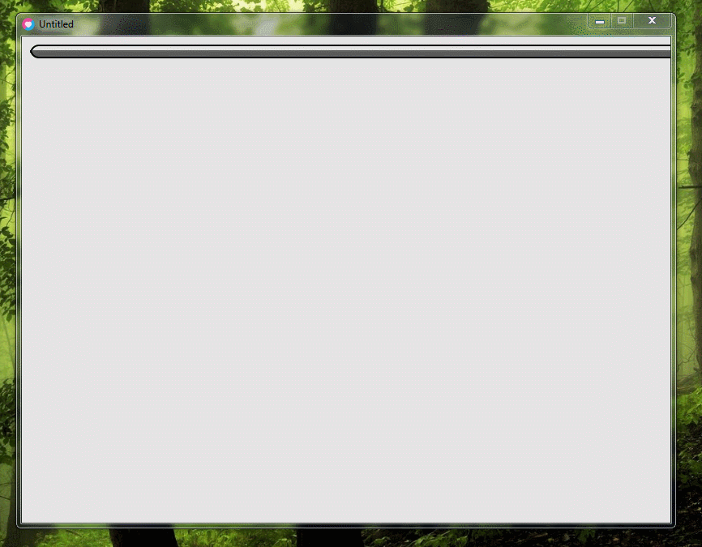

# lovepatch

This a love2D library that creates and draws 9-patch images. https://en.wikipedia.org/wiki/9-slice_scaling. Thanks to darkfrei for helping with the code (or just even writing all by himself).
The example code is in the `main.lua` file.

# Demo



# API
```lua
-- Creates a new 9-patch object.
lovepatch.load(image|filename, edgeWidth, edgeHeight)

-- Creates a new 9-patch object with custom edges.
lovepatch.load(image|filename, left, right, top, bottom)

-- Draws a 9-patch object at the given position with the given size.
-- sx, sy - scale
lovepatch.draw(patch, x, y, width, height, sx = 1, sy = 1)
```